# HUAWEI体验课

**2211771 原敬闰**

## 环境配置

首先需要安装 python 3.7.5，但是我的电脑已经安装了 3.11.4，所以陷入僵局，执行命令：

```sh
python -m pip install https://ms-release.obs.cn-north-4.myhuaweicloud.com/1.7.0/MindSpore/cpu/x86_64/mindspore-1.7.0-cp37-cp37m-win_amd64.whl --trusted-host ms-release.obs.cn-north-4.myhuaweicloud.com -i https://pypi.tuna.tsinghua.edu.cn/simple
```

的时候一直在报错，最后只好下载了 3.7.5 之后暂时将 3.11 中的可执行程序改名，随后在作业文件夹下配置一个 3.7 的虚拟环境~~然后将名字改回来~~，这样就可以在作业文件夹下下载 MindSpore。

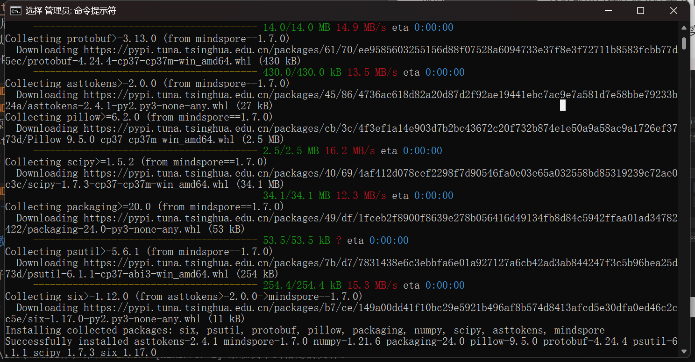

## 基于 MindStudio 的 DeepFM 点击率预估实验

下载源代码和数据并使用 MindStudio 打开，随后按照实验指导书下载 MindStudio 并为项目配置 python 编译环境：

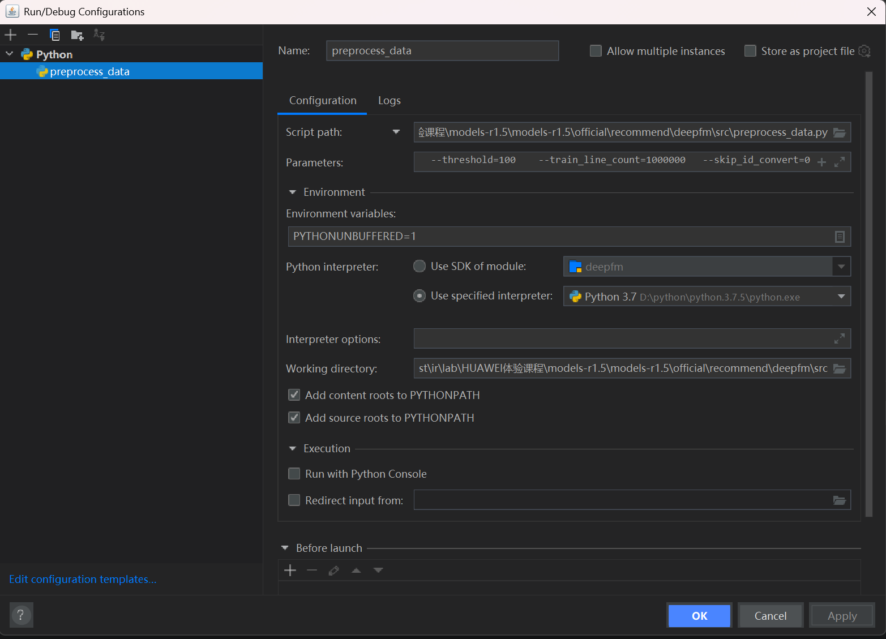

### 数据集预处理

运行 `preprocess_data.py`：

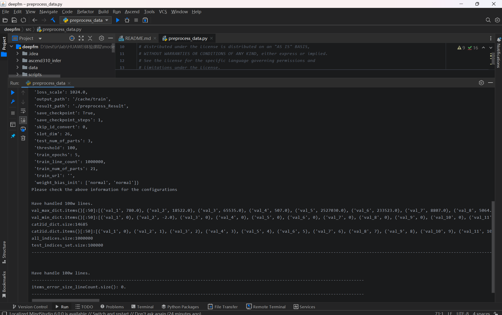

可以在 `deepfm\data\mindrecord` 中查看处理好的数据：

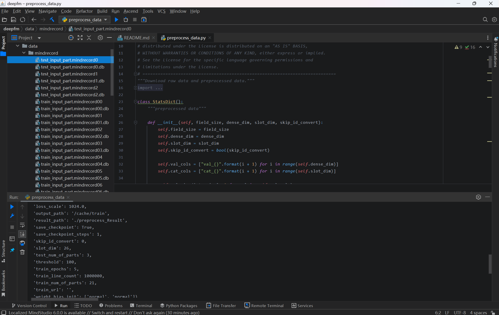

### 模型训练

运行 `train.py` 文件进行模型训练，可以看到训练过程中输出的损失值：

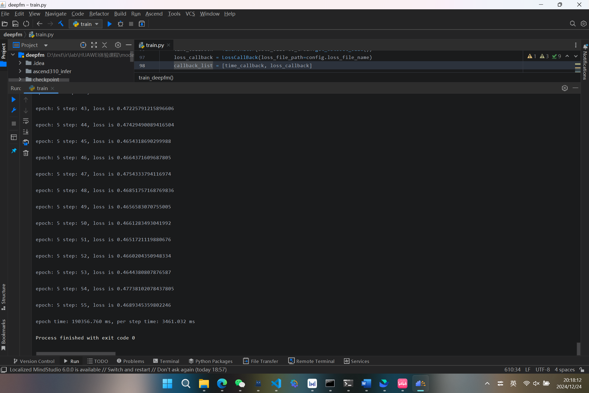

也可以在 `loss.log` 文件夹中查看项目损失值：

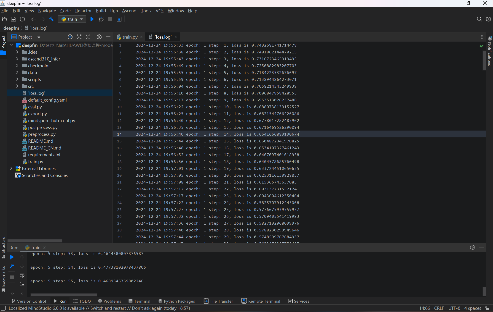

### 模型评估

运行 `eval.py` 文件进行评估：

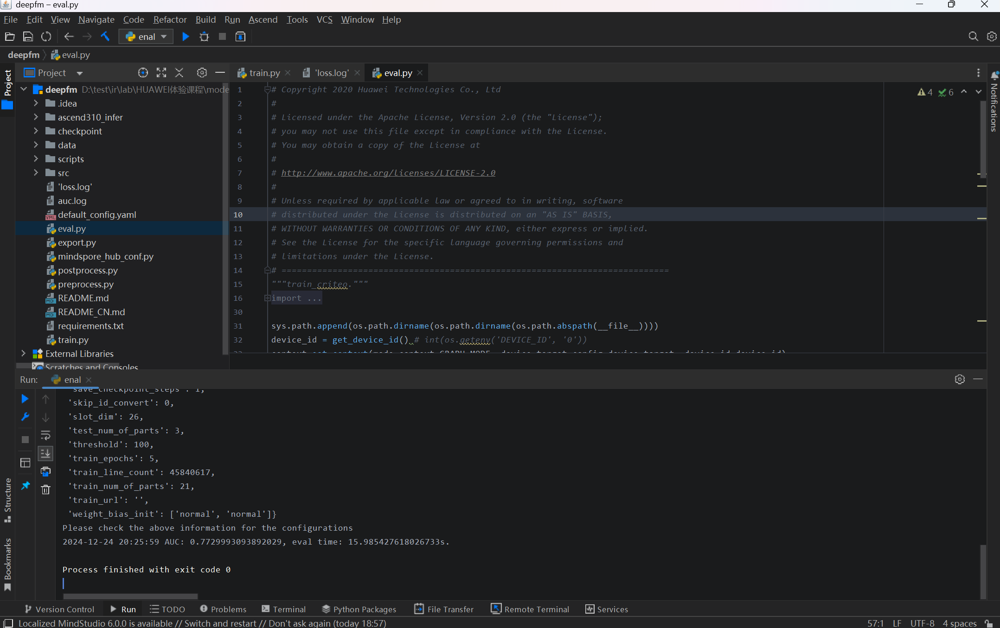

随后在 `auc.log` 文件中查看准确率日志：

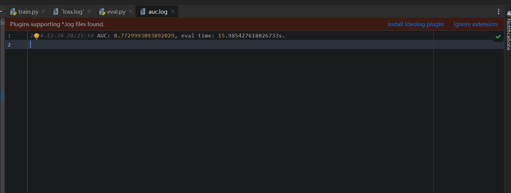

### 导出 MindIR

执行 `export.py` 脚本以导出模型文件：

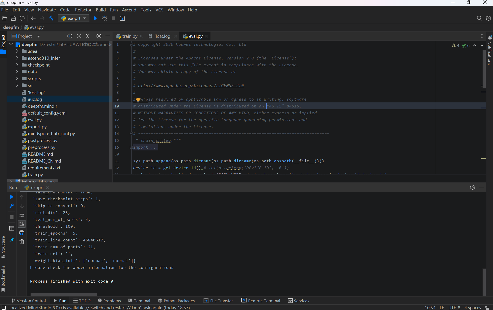

可以看到目录下的 `deepfm.mindir` 模型文件：

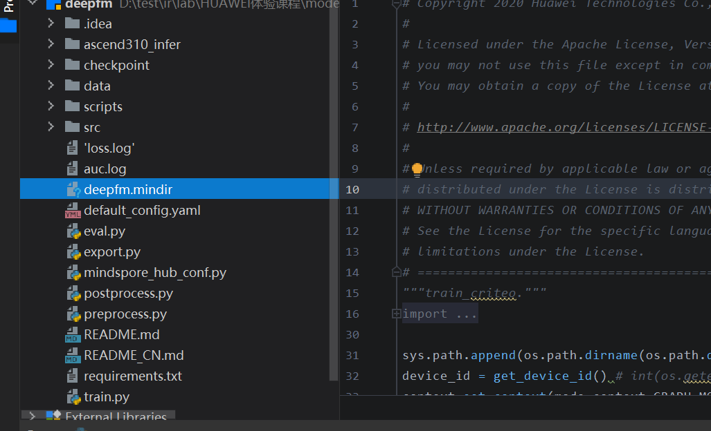

### 实验中遇到的问题

遇到的主要问题是配置环境的问题，上面已经叙述过，其次的问题在于第一次运行完 `preprocess_data.py` 后，执行 `train.py` 莫名其妙的出错：显示某个文件不存在或没有权限。

于是我尝试重新运行 `preprocess_data.py` 文件，出错了，于是删除掉所有第一次的输出，预处理又可以运行了，所以重新运行 `train.py`，然后就成功解决了这个问题，~~虽然我也不知道为什么第一次运行会出错~~。

## 基于 MindSpore 的广告推荐

### 环境配置

首先在 OBS 新建一个桶，并将所需要的源码和数据集上传：

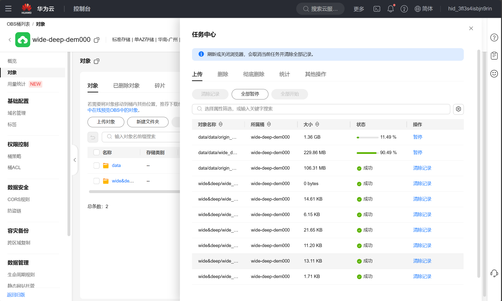

在华为云控制台新建一个 Notebook：

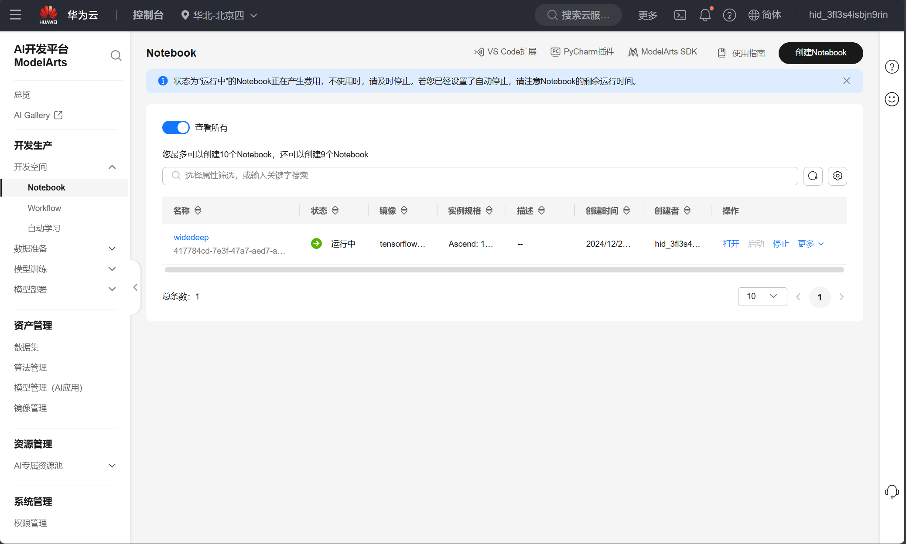

运行代码将桶中的数据和源码导入进来：

```python
import moxing as mox
#src_url：用户自己创建的obs路径
mox.file.copy_parallel(src_url="obs://first-first000/wide&deep/",dst_url="./")
mox.file.copy_parallel(src_url="obs://first-first000/data/",dst_url="./data")
```

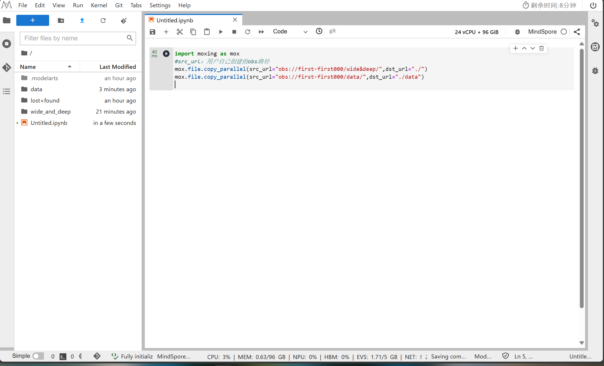

### 数据处理

进入到 `/home/ma-user/work` 路径下，在终端中执行命令：

```sh
python src/preprocess_data.py --data_path=./data/ --dense_dim=13 --slot_dim=26 --threshold=100 --train_line_count=45840617 --skip_id_convert=0
```

可以看到 `data` 目录下生成了 `mindrecord` 文件夹，里面存放了 mindrecord 数据，结果如图：

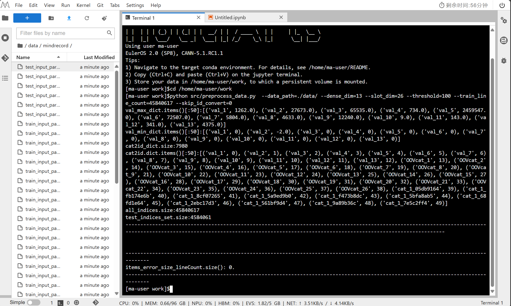

### 模型训练

进入到 `/home/ma-user/work` 路径下，在终端中执行命令：

```sh
python train_and_eval.py --data_path=./data/mindrecord --data_type=mindrecord
```

可以看到如下的训练过程输出信息：

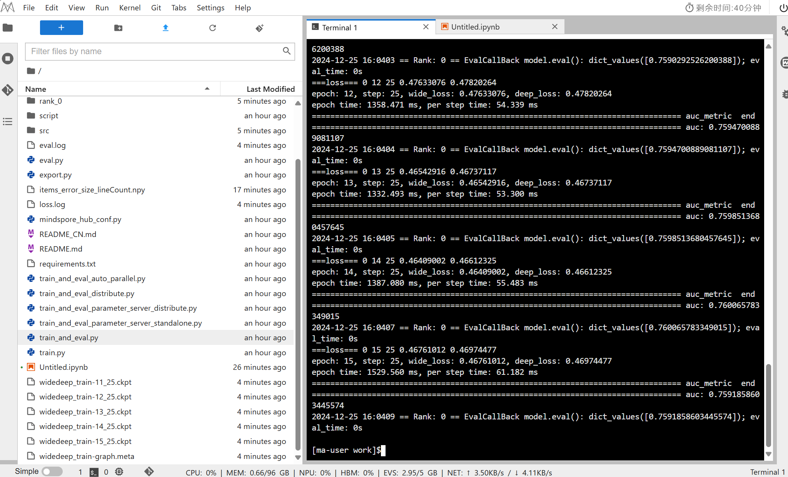

在左侧列表中可以看到生成的模型文件。

### 模型评估

进入到 `/home/ma-user/work` 路径下，在终端中执行命令：

```sh
python eval.py --data_path=./data/mindrecord --data_type=mindrecord --ckpt_path=./widedeep_train-15_25.ckpt
```

模型评估结果如下：

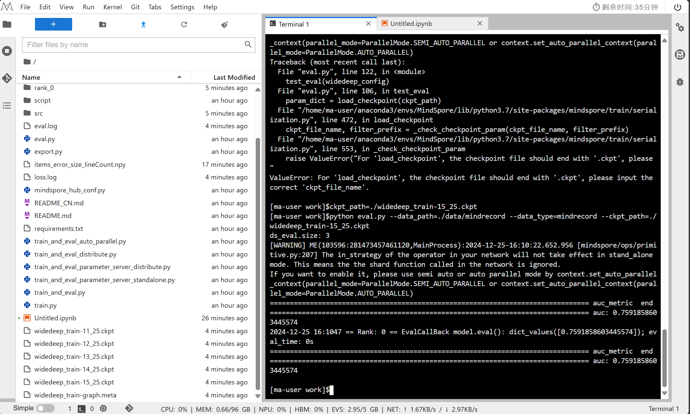

### 遇到的问题

1. 首先是数据始终无法导入到 notebook 中，询问助教尝试修改权限等等之后仍然不行，最后助教提到要将二者放在同一个区中，于是重新创建一个桶，可以成功导入文件。
2. 上传源码和数据的时候一致失败，尤其是较大的文件夹，应该是网络问题，一直重试才成功。
